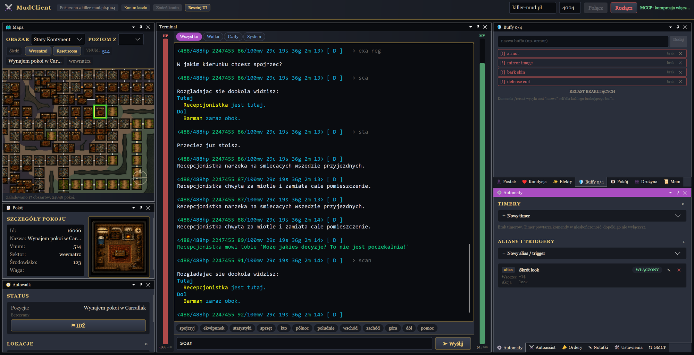

# KillerMudClient

[](https://github.com/laszlowaty/killer-mud-client/actions/workflows/ci.yml)
[](https://github.com/laszlowaty/killer-mud-client/releases)
[](https://laszlowaty.github.io/killer-mud-client/)

Wieloplatformowy klient MUD napisany w C# i Avalonia, tworzony z myślą o [killer-mud.pl](http://killer-mud.pl).

**Strona projektu i pobieranie:** https://laszlowaty.github.io/killer-mud-client/



## Funkcje

### Połączenie i protokoły

- połączenie TCP z MUD-em, stanowa obsługa protokołu Telnet,
- negocjacja `GMCP`, `NAWS`, `TTYPE`, `EOR` i `SUPPRESS-GO-AHEAD`,
- MCCP2 (kompresja zlib): dekompresja włączana dokładnie na granicy `IAC SB 86 IAC SE`; bajty odebrane po znaczniku w tym samym odczycie TCP trafiają do dekompresora, a zakończenie strumienia zlib przez serwer przywraca odczyt bez kompresji,
- konta z hasłem szyfrowanym DPAPI (Windows, per użytkownik) i automatycznym logowaniem; profil JSON nigdy nie zawiera hasła w postaci jawnej, a usunięcie profilu wymaga potwierdzenia.

### Terminal

Czcionkę i rozmiar tekstu terminala można ustawić niezależnie od wspólnej czcionki
pozostałych dokowanych widgetów. Oba ustawienia są globalne i zapisywane automatycznie.
Terminal i widgety mają również niezależne opcje pogrubienia tekstu.
Do aplikacji dołączono również czcionkę OpenDyslexic. Jest dostępna w obu listach bez
instalowania jej w systemie operacyjnym. Pliki fontu są rozpowszechniane na licencji
SIL Open Font License 1.1; jej treść znajduje się w `Assets/Fonts/OpenDyslexic/OFL.txt`.

- kolory ANSI SGR: 16 kolorów z wybieralnymi schematami (ciepły, colorblind w skali szarości i jaskrawy wzorowany na domyślnej palecie Mudleta), mudletowe rozjaśnianie kolorów 30–37 przez SGR bold, 256 kolorów, RGB, underline i reset,
- filtry kanałów nad terminalem: Wszystko / Walka / Czaty / System,
- opcjonalne zawijanie długich linii (word wrap), przełączane w ustawieniach systemowych i zapamiętywane między uruchomieniami,
- zwirtualizowany bufor wyjścia: tekst trafia do bufora pierścieniowego (do 10 000 linii), a rysowane są wyłącznie linie widoczne w viewporcie (`OutputPaneControl`, własny `ILogicalScrollable`) — koszt dopisania tekstu nie zależy od wielkości scrollbacka, więc wielogodzinne sesje nie spowalniają UI,
- zaznaczanie i kopiowanie tekstu lub kolorowego fragmentu terminala jako obrazu do schowka systemowego (przeciąganie myszą + menu kontekstowe).

Renderer ANSI jest celowo liniowy: obsługuje kolory tekstu MUD, ale ignoruje terminalowe komendy przesuwania kursora. To jest odpowiedni model dla typowego klienta MUD.

### Mapa świata i autowalk

- interaktywna mapa świata (17 obszarów, ~25 000 pokoi) renderowana własną kontrolką Avalonia, z biomowymi podkładami graficznymi, zoomem względem kursora i widokiem strategicznym przy dużym oddaleniu,
- śledzenie pozycji postaci przez GMCP (`Room.Info`); każda zmiana lokacji ponownie włącza tryb śledzenia i centruje mapę na aktualnym pokoju,
- znaczniki członków drużyny na mapie na podstawie pokojów z GMCP `Char.Group` (złoty znacznik oznacza lidera),
- opcjonalny **Tryb lorda** w menu mapy udostępnia pod prawym przyciskiem pokoju polecenie `goto <vnum>`; uprawnienia do wykonania komendy nadal weryfikuje serwer,
- pathfinding i automatyczne chodzenie po kliknięciu pokoju, także przez przejścia między poziomami `z`, z politykami odzyskiwania: odpoczynek/`refresh` przy niskim `mv` oraz obsługa zamkniętych bram (szczegóły w sekcji [Mapa świata](#mapa-świata)).
- zapisane cele autowalk można usuwać dopiero po potwierdzeniu operacji.

### Panele postaci (GMCP)

Dokowalne, konfigurowalne panele (układ można przestawiać, przycisk **Resetuj UI** przywraca domyślny):

- **Postać** — statystyki postaci,
- **Kondycja** — HP/MV i stan witalny,
- **Efekty** — aktywne efekty,
- **Buffy** — lista wymaganych buffów z podświetleniem brakujących; komenda `/recast` jednym ruchem rzuca wszystkie brakujące,
- **Pokój** — szczegóły bieżącego pokoju (id, vnum, sektor, grafika),
- **Drużyna** — skład i stan grupy,
- **Mem** — zapamiętane czary,
- **GMCP** — surowy podgląd pakietów GMCP.

### Killeropedia

Przycisk **killeropedia** w górnym pasku otwiera duży, zakładkowy widget. Zakładka
**Nauczyciele** zawiera lokalny spis nauczycieli i ich umiejętności z wyszukiwaniem
po nazwie, umiejętności, klasie, krainie oraz vnum. Bazowy katalog pochodzi z
[`MudletScripts/kbase/teachers.json`](https://github.com/laszlowaty/MudletScripts/blob/master/kbase/teachers.json)
i jest uzupełniony o wpisy utrzymywane w `TeacherCatalogLoader`.

Przycisk **Pokaż na mapie** przy nauczycielu z rozpoznanym pokojem zamyka Killeropedię,
zaznacza jego lokalizację i rysuje dostępną trasę bez uruchamiania autowalka.

Zakładka **Księgi Magiczne** czyta lokalny `killeropedia-books.json` i pozwala
wyszukiwać po nazwie księgi, zaklęciu, profesji, miejscu ładowania oraz vnum.
Katalog może odtworzyć wyłącznie narzędzie deweloperskie sterowane stałymi w
`DeveloperFeatures.cs`: osobno można pokazać/ukryć przycisk **Odśwież** oraz zezwolić
na jego użycie. Aktywacja jest domyślnie wyłączona. Odświeżanie wymaga połączenia,
pobiera listy dla `druid`, `mag`, `paladyn`, `nomad` i `kleryk`, a następnie szczegóły
każdego unikalnego vnum. Gotowy katalog jest zapisywany atomowo w katalogu ustawień
aplikacji; `BookCatalogOutputPath` pozwala twórcy wskazać ścieżkę snapshotu w repozytorium.

### Pomoc aplikacji

Przycisk **Pomoc** w górnym pasku otwiera opis dostępnych komend klienta: `/idz`,
`/idz <cel>`, `/stop` oraz `/recast`.

### Automatyzacja

- **Automaty** — aliasy i triggery z wzorcami oraz timery powtarzające komendy; aktywne timery mają countdown przy prawej krawędzi terminala, a usunięcie pojedynczego wpisu wymaga potwierdzenia,
- **Foldery** — timery, aliasy, triggery, cele autowalk i notatki można układać w zagnieżdżonych folderach metodą drag&drop; folder obsługuje grupowe usuwanie, globalność oraz włączanie/wyłączanie tam, gdzie ma to zastosowanie, a usunięcie folderu timerów, aliasów lub triggerów wymaga potwierdzenia,
- **Import i eksport** — pojedyncze aliasy, triggery i timery oraz całe drzewa ich folderów można przenosić w wersjonowanym formacie JSON; podczas importu identyfikatory folderów są bezpiecznie mapowane na nowe,
- **Autoassist** — opcjonalne wysłanie `as`, gdy GMCP wskaże walczącego członka drużyny w bieżącym pokoju; komenda jest ponawiana, jeśli postać przestanie walczyć, a członek drużyny nadal walczy,
- **Ordery** — opcjonalne wykonywanie komendy z komunikatu `Gracz rozkazuje ci 'komenda'.`, wyłącznie gdy nadawca jest członkiem aktualnej grupy GMCP,
- **Notatki** — panel na własne zapiski.

## Pobieranie

Gotowe paczki (self-contained, jeden plik wykonywalny, bez instalacji) są na [stronie projektu](https://laszlowaty.github.io/killer-mud-client/) oraz w [GitHub Releases](https://github.com/laszlowaty/killer-mud-client/releases): `win-x64`, `linux-x64`, `osx-arm64`, `osx-x64`.

Po uruchomieniu aplikacja nieblokująco sprawdza publiczne wydania GitHub. Gdy jest
dostępna nowsza wersja (również beta), w górnym pasku pojawia się powiadomienie
z odnośnikami do pobrania właściwego wydania i pełnej listy zmian. Brak sieci nie
wpływa na uruchamianie ani korzystanie z klienta.

Na macOS binarka nie jest podpisana — po rozpakowaniu:

```bash
chmod +x KillerMudClient-*
xattr -dr com.apple.quarantine .
```

## Budowanie ze źródeł

### Wymagania

1. .NET 10 SDK.
2. Opcjonalnie VS Code z rozszerzeniami **C# Dev Kit** i **Avalonia for VS Code** (projekt ma gotowe zadania i konfigurację debugowania).

### Budowanie i uruchomienie

```bash
dotnet restore
dotnet build
dotnet test
dotnet run --project src/MudClient.App
```

Na Windows pełną walidację najlepiej uruchamiać przez `./verify.ps1` albo
`verify.bat`. Skrypt buduje rozwiązanie i uruchamia oba projekty testowe osobno
w `artifacts/verify`, wykrywa zawieszone procesy testowe korzystające z tego
katalogu i domyślnie usuwa wszystkie artefakty w bloku `finally`. Przełącznik
`-KeepArtifacts` pozostawia wyniki do diagnostyki; kolejne uruchomienie skryptu
i tak wyczyści je przed rozpoczęciem pracy.

W VS Code możesz również nacisnąć `F5` albo uruchomić zadanie `run`. Skróty: `.\run.ps1` / `.\run.bat` (Windows), `./run.sh` (Linux/macOS).

### Publikacja lokalna

Skrypty przyjmują wariant `beta` albo `release` (domyślnie `release`) i czytają wersję z `Directory.Build.props`:

- `publish.bat [beta|release]` — Windows (win-x64, single-file, self-contained),
- `publish.sh [beta|release]` — Linux/macOS (RID wykrywany automatycznie),
- `publish-mac.bat [beta|release]` — cross-kompilacja macOS (arm64 + x64) z Windows.

Przed `dotnet publish` skrypty czyszczą katalog docelowy wybranego wariantu, dzięki czemu paczka nie zawiera plików po starszej wersji.

### Wydania (GitHub Actions)

Oficjalne wydania buduje workflow **Release** (zakładka Actions → Release → *Run workflow*):

- wybierasz kanał: `beta` → pre-release z tagiem `vX.Y.Z-beta.N` (numer bety nadawany automatycznie), `release` → pełne wydanie z tagiem `vX.Y.Z`,
- wybierasz podbicie wersji: `patch` / `minor` / `major` / `none` — workflow aktualizuje `Directory.Build.props`, commituje i taguje,
- po przejściu testów budowane są paczki `win-x64`, `linux-x64`, `osx-arm64`, `osx-x64` i publikowane jako GitHub Release z automatycznymi notatkami.

Poza tym workflow **CI** buduje projekt i odpala testy przy każdym pushu i pull requeście do `main`, a workflow **Deploy GitHub Pages** publikuje stronę projektu z katalogu `docs/`.

## Gdzie wpisać adres MUD-a

Po uruchomieniu aplikacji wpisz host i port na górnym pasku, następnie kliknij **Połącz**. Możesz też utworzyć konto (host, port, login, hasło) — klient zaloguje się automatycznie.

## Kopia i import ustawień

Panel **Ustawienia** pozwala wyeksportować do ZIP cały katalog danych aplikacji (`%AppData%\KillerMudClient`), łącznie z ustawieniami, profilami, automatyzacją, zapisanym układem i pozostałymi danymi. Import jest najpierw sprawdzany i przygotowywany, po czym klient automatycznie uruchamia się ponownie i zastępuje cały obecny katalog zawartością kopii.

## Struktura

```text
src/
├── MudClient.Core/       # Telnet, GMCP, TCP, mapa, aliasy, triggery, timery
└── MudClient.App/        # Avalonia, panele, widoki i renderowanie ANSI
tests/
├── MudClient.Core.Tests/ # testy silnika bez uruchamiania GUI
└── MudClient.App.Tests/  # testy warstwy aplikacji
tools/
└── MudClient.MapBackdropGenerator/ # generator podkładów mapy
docs/                     # strona GitHub Pages
```

Najważniejsza granica architektoniczna: `MudClient.Core` nie zależy od Avalonia. Dzięki temu parser i silnik można testować bez GUI.

## Mapa świata

Zakładka **Mapa** obok **Gra** pokazuje mapę świata renderowaną własną kontrolką Avalonia (`WorldMapControl`), bez SkiaSharp ani innego ciężkiego silnika graficznego.

### Warstwy

- `MudClient.Core/Map/` — modele (`MapDocument`, `MapArea`, `MapRoom`, `MapExit`), `MapLoader` (asynchroniczne, tolerancyjne wczytywanie JSON-a), `MapIndex` (indeksy po id, vnum, obszarze/z, oraz siatka przestrzenna do renderowania tylko widocznych pokoi), `CollisionLayoutService` (deterministyczne rozkładanie pokoi o identycznych współrzędnych) — bez zależności od Avalonia.
- `MudClient.App/Controls/WorldMapControl.cs` — jedna kontrolka rysująca mapę przez `DrawingContext` (bez osobnych kontrolek per pokój), obsługa przeciągania, zoomu względem kursora, klawiatury oraz zaznaczania pokoi/grup kolizji. Renderer ma tryb graficzny i prosty. Tryb graficzny najpierw buduje z sektorów i połączeń widoczną warstwę krajobrazu (biomy, linie brzegowe, drogi i delikatne tekstury), a następnie nakłada techniczną mapę pokoi, trasę i bieżącą pozycję. Poniżej zoomu `0.45` przechodzi w prekomponowany widok strategiczny: dwie bitmapy zawierają interpolowane biomy oraz wszystkie pokoje i połączenia, a runtime dokłada tylko trasę, zaznaczenie i pozycję gracza. Tryb prosty pomija bitmapy, tekstury i krajobraz, rysując na czarnym tle kwadraty w kolorach sektorów. Repaint podczas przeciągania jest scalany przez kolejkę UI.
- `MudClient.App/Services/SectorTextureCache.cs` — leniwe ładowanie i cache'owanie `Bitmap` per sektor, z fallbackiem gdy brakuje PNG.
- `MudClient.App/ViewModels/MapViewModel.cs` — ładowanie mapy poza wątkiem UI, śledzenie postaci, wybór obszaru/poziomu z.

### Pliki mapy

- Świat: `src/MudClient.App/Assets/Map/world-map.json`
- Grafiki sektorów: `src/MudClient.App/Assets/Map/Sectors/*.png`
- Neutralne tło atlasowe dla obszarów bez pokojów: `src/MudClient.App/Assets/Map/Sectors/world-background.png`
- Klimatyczne tła kontynentów i konkretnych lokacji są osadzane warstwowo we współrzędnych świata przez `src/MudClient.App/Assets/Map/Locations/manifest.json`; szczegółowe ilustracje miast mogą leżeć nad atlasem kontynentu, a pokoje, wyjścia i trasy pozostają rysowane nad nimi.
- Prekomponowane tła biomów i warstwy pokojów: `src/MudClient.App/Assets/Map/Backdrops/`
- Opcjonalny manifest nazw sektorów: `src/MudClient.App/Assets/Map/Sectors/sectors.json`
- Konfiguracja mapy: `src/MudClient.App/Assets/Map/map-settings.json`

Wszystkie te pliki są kopiowane do katalogu wynikowego (`CopyToOutputDirectory=PreserveNewest`) i odnajdywane względem `AppContext.BaseDirectory`, więc aplikacja działa niezależnie od komputera, na którym została zbudowana. Brak `world-map.json` nie powoduje awarii — zakładka Mapa pokazuje czytelny komunikat z oczekiwaną ścieżką.

Backdropy są deterministycznie generowane z sektorów, nazw, współrzędnych i wyjść pokojów. Po zmianie `world-map.json` należy je odtworzyć poleceniem:

```powershell
dotnet run --project tools/MudClient.MapBackdropGenerator -- src/MudClient.App/Assets/Map/world-map.json src/MudClient.App/Assets/Map/Backdrops
```

### Lokalny kalibrator ilustracji mapy

Projekt `tools/MudClient.MapImageCalibrator` jest osobnym narzędziem autora i nie należy do solution ani paczki wydawanej graczom. Uruchom go z katalogu repozytorium:

```powershell
dotnet run --project tools/MudClient.MapImageCalibrator
```

Kalibrator pozwala wybrać pojedynczą warstwę miasta, zaznaczać prostokątem lub lassem grupy roomów i przesuwać ich roboczą siatkę, korygować pojedyncze roomy oraz umieszczać na ilustracji numerowane markery z opisami. Z dowolnego zaznaczenia na jednej mapie i poziomie Z można też utworzyć nazwaną warstwę z czarnym płótnem 1200×800, a następnie przygotować na niej siatkę i wskazówki do pierwszego wygenerowania grafiki. Eksport tworzy screenshot i plik JSON stanowiące instrukcję do późniejszej edycji grafiki; `world-map.json` nie jest modyfikowany. Narzędzie pozwala też opcjonalnie przesunąć całą ilustrację i zapisać manifest. Prawy przycisk myszy przesuwa widok, kółko zmienia zoom, a przycisk **Pomoc** otwiera pełną instrukcję pracy.

### Wykrywanie aktualnego pokoju z GMCP

Domyślnie `GmcpLocationResolver` nasłuchuje pakietu `Room.Info` i szuka vnum pod ścieżkami `vnum`, `num`, `room.vnum`, `room.num`, `location.vnum`, `location.num` (w tej kolejności). Aby dopasować inny serwer MUD, który wysyła lokalizację pod innym pakietem lub inną ścieżką, zmień `gmcpLocation.packages` i `gmcpLocation.vnumPaths` w `map-settings.json` — nie wymaga to zmian w kodzie.

### Odzyskiwanie ruchu i zamknięte bramy w autowalku

Przed każdym krokiem autowalk sprawdza ostatnie `mv/max_mv` z `Char.Vitals`. Przy poziomie 10% lub niższym rzuca `refresh` na siebie, jeśli gotowy czar znajduje się w `Char.MemSpell`; w przeciwnym razie wysyła `rest`, czeka 30 sekund i wznawia trasę. Gdy GMCP `Char.Condition` zgłosi `position: POS_SITTING`, autowalk wysyła `stand` i czeka z następnym krokiem na potwierdzenie `POS_STANDING`. Zatrzymanie autowalku anuluje oczekiwanie.

Jeżeli próba otwarcia bramy kończy się komunikatem o zamknięciu na klucz, klient wysyła kolejno `zapukaj`, `pull` i `uderz`. Ruch jest wznawiany dopiero po wysłaniu całej sekwencji i potwierdzeniu przez `Room.Info`, że wyjście używane przez bieżący krok nie jest już zamknięte.

## Czego jeszcze nie ma

- trwałego zapisu profili w SQLite (profile są w plikach JSON),
- rozbudowanej historii komend,
- pełnego terminala z pozycjonowaniem kursora,
- TLS.

## Następne sensowne kroki

1. Zapisać surowe sesje Telnet do pliku i dodać replay w testach.
2. Rozbudować historię komend.
3. Dodać TLS.

## Ważne przy pracy z AI

Przeczytaj `AGENTS.md`. Zawiera zasady, które ograniczają mieszanie warstw i generowanie trudnego do utrzymania kodu.
